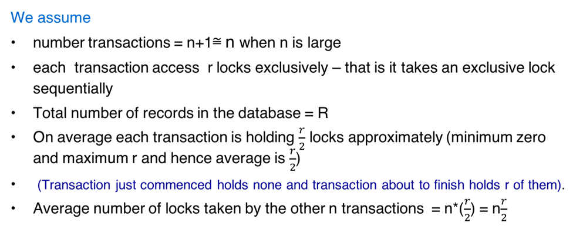
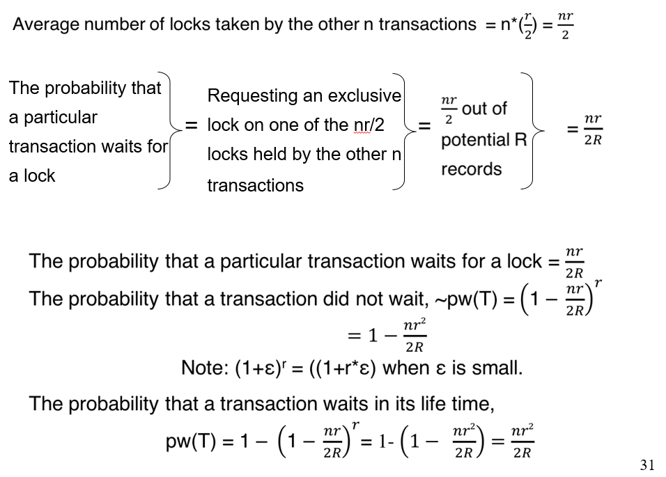

# Week 4

 

###  ACID

**Atomicity**: all or nothing. When apply for transaction, all of them are done or not at all. 

**Consistency**: the most difficult; If transaction is parallel, Preserving an Invariant

**Isolation**: every transactions have to wait until last transaction finish modifying. ->locking protocol -> sequential 

**Durability**: either entire block is written correctly on disk or the contexts of the block is unchanged. -> use version number and write sequentially.

 

### Atomic Disk Writes

entire block is written correctly on disk or the content of the block is unchanged. 

 

### Logged write:

similar to the duplex write

 

 

### CRC: Cyclic Redundancy Check

 

Good to check changes

do XOR

Shifting by bit

get reminder

The reminder is called CRC

Then do it again

if everything is correct

you will get a 0 reminder

The reminder will tell which bit goes wrong

 reliable

 

 

## Transaction models

Foreign key: this attribute is a key for another table.

### Flat

Can be a very long running transaction. Any failure of transaction requires lot of unnecessary.

Do everything or not at all (if meet requirement, commit, otherwise, roll back)

(先做了再说)

limitation: not convenient; not good for large scale

 

### Nested

divide transaction into hierarchic

Commit rule: 

* A subtransaction can either commit or abort, however, commit cannot take place unless the parent (and patent's parents) itself commits.
* Subtransactions have  A, C, and I properties but **not have D** property unless all its ancestors commit.
* Commit of a sub transaction makes its results available only to its parents.

Roll back Rules

* If a subtransaction rolls back all its children are forced to roll back.

Visibility Rules

* Changes made by a sub transaction are visible to the parent only when the sub transaction commits. Whereas all objects of **parent are visible to its children**. Implication of this is that the parent should not modify objects while children are accessing  them. This is not a problem as parent is not run in parallel with its children.

 

### TP monitor

Batch Processing

Time-sharing

Real-Time processing

Client-Server Processing 

Presentation service : defines interface between the application and the devices it has to interact to.  

Queue management

 

### Dekker's algorithm

C1，C2，turn

 

### Spinlock 自旋锁

Lock two CPU cycle, one for reading, one for writing. Reading and writing cannot be interpreted. Use busy waiting.

a **spinlock** is a lock which causes a thread trying to acquire it to simply wait in a loop ("spin") while repeatedly checking if the lock is available

Not suitable for single CPU system.

 

### Dead lock

Each one waiting for others. 

System look prefect

have loop(s)

**Solution**

* Have enough resources
* Do not let a process simply rollback. -> makes live looks worse than deadlocks. -> everything seems working.
* Resource level: Linearly order the resources and request of resources should follow order. J > I 
* Pre-declare all resources in a single request -> only request once;
* wait and rollback
* Check resource dependency graph for cycles. ->  no hierarchies -> kill cycles (transactions)
* Use time out for global deadlock (for distribute database systems)
* Phantom Deadlock

**Calculate the probability of a deadlock**

 