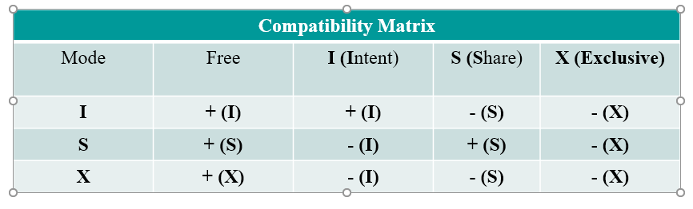
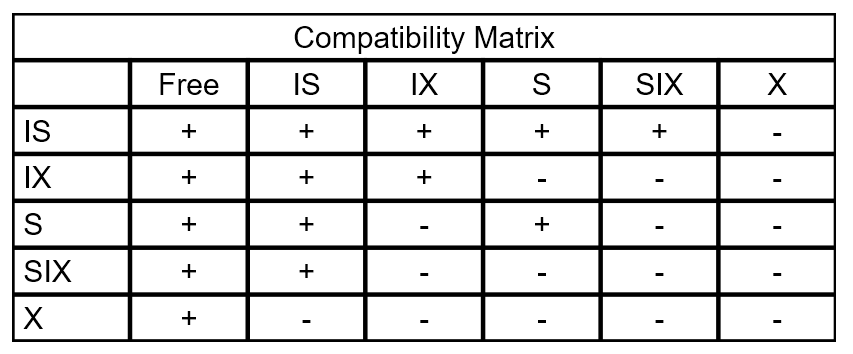

# Week 6

Something about presentation...

----

LectureSet5

---

Phantoms and Predicate locks:

When doing query, system will generate shared lock to satisfied tuples. When generate locks, there might have new transaction to insert some values.

Use predicate locks and page locks can solve this problem

### Predicate locks  谓词锁

Read and write sets can be defined by predicates (e.g. Where clauses in SQL statements) and associate a lock with such a set.

**problems**

### Granularity Locks  粒度锁

* Pick a fixed set of predicates.
* They form a lattice or a tree.
* Lock the nodes in this graph/lattice/tree 

 

 

#### Intention Lock  意向锁

IS, IX, U, S, SIX, X;

IS: intend to set shared locks;

U: Intention to update in the future  

SIX: take shared lock at moment, has intention to take excusive lock

 

### Convoy

Long chain of waiting things.

FIFO can cause the problem of long queues. 

High priority transaction will wait pervious low priority transaction. 

(Do not use FIFO)

### Optimistic Locking

* (take Slocks  briefly read the contents and release the Slocks)
* If face, Don't take lock when read it, -> Only need to take locks when necessary (commit).
* Lock as short as possible -> minimum locking
* before commit (processing data), check value (version) at first. Then check the values read are not modified.
  * If modified  abort the transaction (release all locks) and restart the transaction
  * If not make changes.
* the locking is very short, can force many repeated attempts.

 

### Snapshot Isolation

Snapshot Isolation method is used in Oracle but it is not optimistic control and it will **not guarantee Serializability**.  However, its transaction throughput is very high compared to two phase locking scheme.  

First writer can commit.

 

### Crabbing

Link list

Tree search

Steps:

Take the Xlock for entire list, do operation and release the list.

Start from lock from the head, then lock next lock, unlock pervious lock. Repeat until the required node been found.

